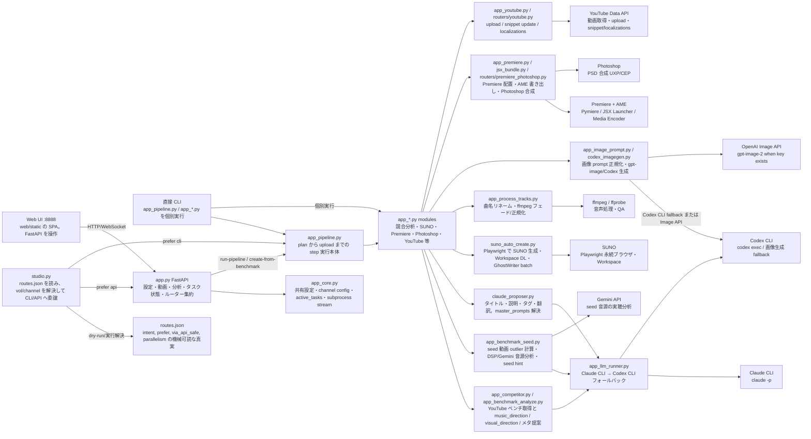
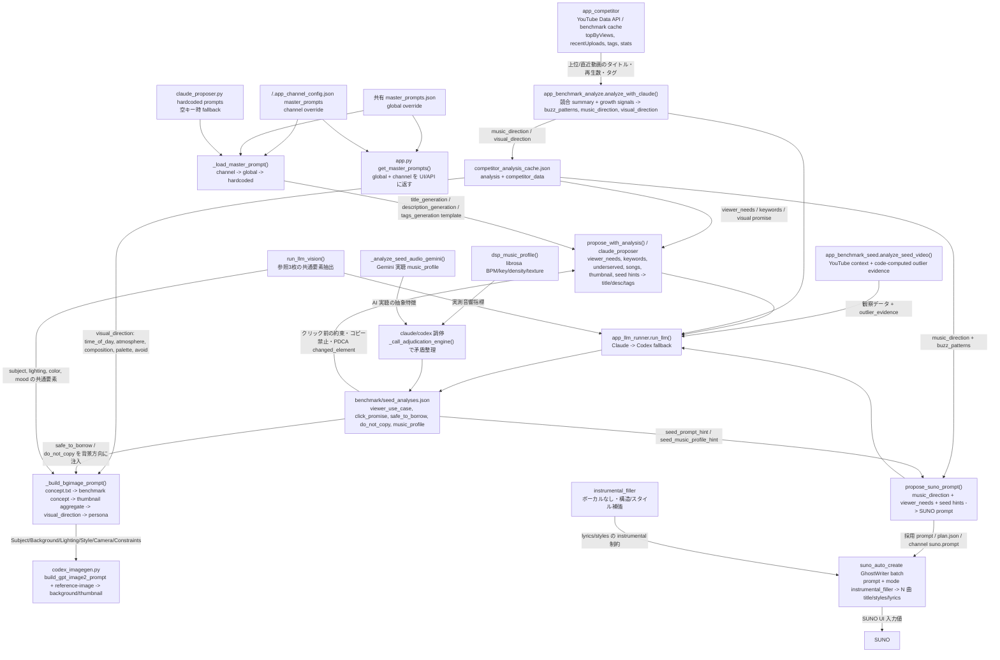
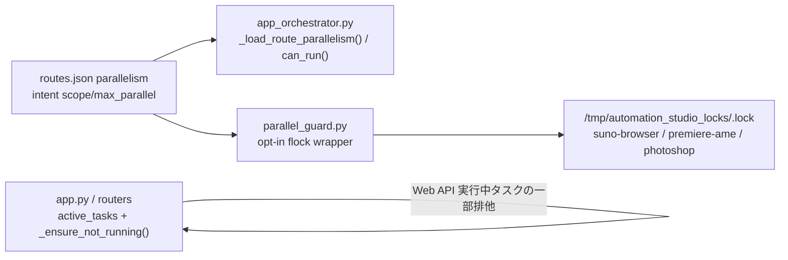

# Automation Studio Architecture Map

この文書は `Python/studio.py` / `Python/app.py` / `Python/app_pipeline.py` / `Python/routes.json` / LLM 関連モジュールを実読して作成した概略図です。推測ではなく、現コードの依存と分岐を優先しています。

## 1. システム構造図

## 2. パイプライン Step 図

```mermaid
flowchart TD
  Plan["plan<br/>step_plan()<br/>competitor_analysis_cache + benchmark axes -> propose_suno_prompt -> plan.json<br/>skip: 通常実行では無し。--from-benchmark 時だけ先頭に入る。既存 plan.json + quality_score + suno_prompt なら再利用"]
  SunoStep["suno<br/>step_suno()<br/>plan/env/channel/global prompt -> suno_auto_create.py<br/>resource: SUNO browser + Claude/Codex GhostWriter<br/>skip/fail: prompt 不在は停止。APP_SUNO_AUTO_DOWNLOAD=0 で DL 後処理をしない"]
  Rename["rename<br/>step_rename()<br/>app_process_tracks.py<br/>resource: Claude/Codex title proposal + ffmpeg<br/>skip: rename-only では ffmpeg 無し。対象 MP3 不足は non-fatal 系"]
  Bg["bgimage<br/>step_bgimage()<br/>_build_bgimage_prompt() -> codex_imagegen.py<br/>resource: gpt-image-2/Codex CLI, benchmark refs<br/>skip: APP_BGIMAGE_DISABLE=1, persona 空, 既存 volN.png/jpg/source.jpg。APP_BGIMAGE_FORCE=1 で再生成"]
  Psd["psd_composite<br/>step_psd_composite()<br/>Photoshop PSD に背景 + scene text -> volN.jpg + サムネイル.jpg<br/>resource: Photoshop + scene text LLM<br/>skip: 既存 2 出力ありかつ force 無し"]
  Prem["premiere<br/>step_premiere()<br/>app_premiere.py / API / JSX で配置<br/>resource: Premiere<br/>skip: export_engine=ffmpeg なら premiere step はスキップ"]
  Export["export<br/>step_export()<br/>AME/Premiere export または app_ffrender.py<br/>resource: AME/Premiere or ffmpeg<br/>branch: export_engine=ffmpeg なら app_ffrender.py で premiere+export 置換"]
  QA["qa<br/>step_qa()<br/>ffprobe で解像度・尺・codec、任意 loudness<br/>resource: ffprobe/ffmpeg<br/>skip: APP_QA_DISABLE=1, mp4 無し, ffprobe 無し"]
  Meta["meta<br/>step_meta()<br/>claude_proposer gather_context -> titles/description/tags<br/>resource: Claude/Codex LLM<br/>writes: youtube_title/description/tags.txt"]
  Loc["localization<br/>step_localization()<br/>translate_metadata -> youtube_localizations.json<br/>resource: Claude/Codex LLM<br/>skip: localization_languages 未設定、title/description 不在"]
  Thumb["thumbnail<br/>step_thumbnail()<br/>_build_thumbnail_prompt() -> codex_imagegen.py -> thumbnail.png<br/>resource: gpt-image-2/Codex CLI<br/>skip: APP_THUMBNAIL_DISABLE=1, thumbnail.png/vol*.jpg/サムネイル.jpg 既存。Flow 指定は codex fallback"]
  Upload["upload<br/>step_upload()<br/>app_youtube.py / API<br/>resource: YouTube Data API<br/>skip: youtube_upload.json marker が現タイトル一致または72h以内。APP_FORCE_REUPLOAD=1 で無効"]

  Plan --> SunoStep --> Rename --> Bg --> Psd --> Prem --> Export --> QA --> Meta --> Loc --> Thumb --> Upload
```

## 3. プロンプトフロー図

## 4. リソース競合マップ

### CLAUDE.md のルール

| リソース | 使う処理 | 文書上の並列性 |
|---|---|---|
| SUNO ブラウザ | 楽曲生成・DL | 単一 |
| Premiere/AME | premiere・export | 単一 |
| Photoshop | psd_composite | 単一 |
| Claude/Codex LLM | meta・localization・scene_text・SUNO GhostWriter・bgimage | competition 注意 |
| ffmpeg | 楽曲後処理 | 並列可 CPU |

### routes.json との突き合わせ

| intent | routes.json parallelism | CLAUDE.md との判定 |
|---|---:|---|
| `suno`, `suno-auto`, `suno-download` | `per-machine:1` | 修正済み。SUNO ブラウザはマシン単位の単一リソースとして routes.json と CLAUDE.md が整合。 |
| `premiere`, `place-images`, `export`, `pipeline-from-premiere` | `per-machine:1` | 整合。Premiere/AME は単一。 |
| `psd` | `per-machine:1` | 整合。Photoshop は単一。 |
| `bgimage`, `thumbnail` | `global:2` | 概ね整合。ただし LLM/Codex quota は competition 注意。 |
| `meta`, `localization`, `propose` | `global:3` | 概ね整合。ただし Claude/Codex usage limit には注意。 |
| `rename`, `process`, `qa` | `global:4` | ffmpeg 並列可と整合。 |
| `pipeline` | `per-channel:1` | 部分不整合。pipeline 内に SUNO/Premiere/Photoshop 単一資源が含まれるため、別 channel の pipeline 同時実行は物理資源競合の可能性がある。 |

### 実装上の補足

`Python/parallel_guard.py` は既存挙動を変えない opt-in です。SUNO/Premiere/Photoshop の三大単一リソースは `suno-browser` / `premiere-ame` / `photoshop` に明示マップしています。

## コードと文書の不整合

1. 修正済み: `AGENTS.md` の AI サムネ記述を codex 一本化・Flow 指定時 codex フォールバックに更新。
2. 修正済み: `.claude/agents/image.md` の Flow / Nano Banana 2 前提を削除し、codex 一本化に更新。
3. 修正済み: `.claude/agents/pipeline.md` の `STEPS` に `localization` を追加。
4. 修正済み: `routes.json` の SUNO 系を `per-machine:1` に変更し、SUNO ブラウザ単一ルールと整合。
5. CLAUDE.md の pipeline 並列ルールに対し、`routes.json` の `pipeline` は `per-channel:1`。pipeline は内部に SUNO/Premiere/Photoshop を含むため、別 channel 同時実行は物理資源競合の可能性がある。
